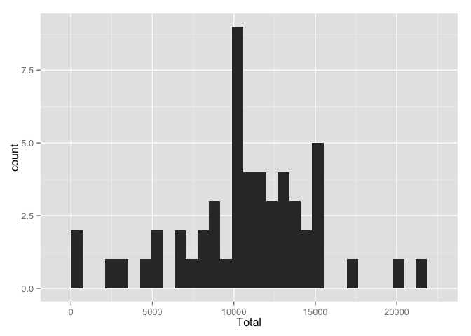
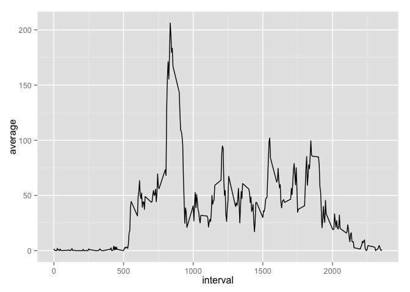
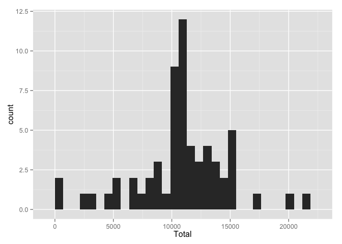
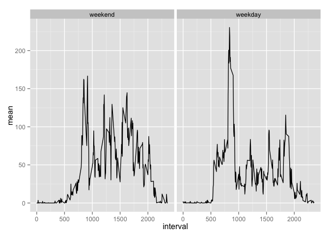

# Reproducible Research: Peer Assessment 1


## Loading and preprocessing the data


```r
# Defining a custom date time class and conversion functions
as.POSIXct.D<-function(from){as.POSIXct(from,format="%Y-%m-%e")}
as.Character.DC<-function(from,value){format(value,format = "%Y-%m-%e")}
setClass("as.POSIXct.D.C",contains = "POSIXct")
setAs("character","as.POSIXct.D.C",as.POSIXct.D,as.Character.DC)
# Loading zip file
unzip.file<-unz("activity.zip",filename = "activity.csv")
# Loading data frame
data<-read.csv(unzip.file, colClasses = c("numeric","as.POSIXct.D.C","numeric"))
# Filtering NAs
data.not.na<-data[which(!is.na(data$steps)),]
# Generating a factor vector of dates
factor.date<-factor(data[[2]])
posixct.date<-as.POSIXct(levels(factor.date),format="%Y-%m-%e")
# Generating a factor vector of intervals
factor.interval<-factor(data[[3]])
integer.interval<-as.integer(levels(factor.interval))
```

## What is mean total number of steps taken per day?


```r
# Computing total steps per day
data.date.totalperday<-tapply(data[[1]],factor.date,sum)
data.date.totalperday <- data.frame(cbind(Date=posixct.date,Total=data.date.totalperday))
# Ploting the total steps per day frequency
library(ggplot2)
plot.total.step<-ggplot(data.date.totalperday, aes(Total))
plot.total.step + geom_histogram()
```

```
## stat_bin: binwidth defaulted to range/30. Use 'binwidth = x' to adjust this.
```

 

```r
# Computing the median and the mean of total steps per day
median.steps.perday<-median(data.date.totalperday[[2]],na.rm = TRUE)
mean.steps.perday<-mean(data.date.totalperday[[2]],na.rm = TRUE)
```

The median of total steps per day is: 10765  
The mean of total steps per day is: 10766.19  

## What is the average daily activity pattern?


```r
# Computing mean steps per interval
data.interval.avarage<-tapply(data[[1]],factor.interval,mean,na.rm=TRUE)
# Generating plot variable of average per interval
plot.interval.average<-ggplot(data.frame(cbind(interval=integer.interval,average=data.interval.avarage)),aes(interval,average))
# Showing a scatter plot
plot.interval.average + geom_line()
```

 

```r
# Converting a array to a vector
data.interval.avarage<-c(data.interval.avarage)
# Getting the index of maximum average of steps
max.interval.index<-which(data.interval.avarage>=max(data.interval.avarage))
# Getting the interval of the maximum average
max.interval.value<-integer.interval[max.interval.index]
```

The interval with the maximun number of steps is: 835  

## Imputing missing values


```r
# Getting indexes of missing values
na.index<-which(is.na(data$steps))
# Imputting the mean of the intervals as replacement of NAs
data.imputing.na<-data
data.imputing.na[na.index,1]<-floor(data.interval.avarage[as.character(data[na.index,3])])
# Computing total steps per day for the imputted data
data.imputing.na.totalperday<-tapply(data.imputing.na[[1]],factor.date,sum)
data.imputing.na.totalperday <- data.frame(cbind(Date=posixct.date,Total=data.imputing.na.totalperday))
# Ploting the total steps per day frequency
plot.imputing.na.total.step<-ggplot(data.imputing.na.totalperday, aes(Total))
plot.imputing.na.total.step + geom_histogram()
```

```
## stat_bin: binwidth defaulted to range/30. Use 'binwidth = x' to adjust this.
```

 

```r
# Computing the median and the mean of total steps per day
median.steps.perday.imputing.na<-median(data.imputing.na.totalperday[[2]],na.rm = TRUE)
mean.steps.perday.imputing.na<-mean(data.imputing.na.totalperday[[2]],na.rm = TRUE)
```

There are 2304 NAs in the data set.  
The median of total steps per day using the imputted data is: 10641  
The mean of total steps per day using the imputted data is: 10749.77  

Data used to replace the missing values in the data set, has decreased the median and the mean of the data 1.151881% and 0.1524977% respectivally. So, the impact in the total number of steps per day is low.

## Are there differences in activity patterns between weekdays and weekends?


```r
# Creating a data frame without missing values
data.imputing.na.week<-data.imputing.na
# Adding a new column with the name of the day for that observation
data.imputing.na.week$weekend<-weekdays(data.imputing.na.week$date,abbreviate = TRUE)
# Replacing the values of the new column witha boolean that indicates
# whether the day is weekend or not
data.imputing.na.week$weekend<-(data.imputing.na.week$weekend=="Sun" | data.imputing.na.week$weekend=="Sat")
# Converting the new column to a factor
data.imputing.na.week$weekend<-
factor(as.character(data.imputing.na.week$weekend),levels = c("TRUE","FALSE"),labels = c("weekend","week"))
# Computing total mean per interval per week or weekend
data.imputing.na.interval.avarage<-tapply(data.imputing.na.week[[1]],list(data.imputing.na.week[[3]],data.imputing.na.week[[4]]),mean)
# Converting the matrix to data frame
data.imputing.na.interval.avarage<-as.data.frame(data.imputing.na.interval.avarage)
# Converting a dimension in a variable
data.imputing.na.interval.avarage<-stack(data.imputing.na.interval.avarage)
# Agregating the interval as variable in the data frame
data.imputing.na.interval.avarage<-data.frame(cbind(interval=integer.interval,week=as.factor(data.imputing.na.interval.avarage[[2]]),mean=data.imputing.na.interval.avarage[[1]]))
# Converting to factor the week day column
data.imputing.na.interval.avarage$week<-factor(data.imputing.na.interval.avarage$week,levels = c(2,1),labels = c("weekend","weekday"))

# Generating plot variable of average per interval
plot.interval.average.week<-ggplot(data.imputing.na.interval.avarage,aes(interval,mean))
# Showing a scatter plot
plot.interval.average.week + geom_line() + facet_grid(. ~ week)
```

 

